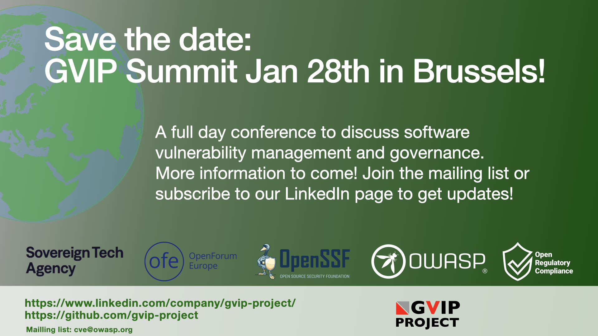

# Events

## GVIP Summit January 28th, 2026, Brussels, Belgium

As part of the [Open Source Week](https://opensourceweek.eu) in Brussels, we're organising the
GVIP Summit - a full day conference focusing on vulnerability management and databases. We'll take
a look into the history, the current situation and into the future. Together
we'll set the direction of future work within the GVIP project.

More details will follow soon. If you want to participate - follow GVIP on
LinkedIn for updates or join the cve@owasp.org mailing list and we'll let you know
as we soon will open for registration (limited seats).

Participation will be free. If you want to contribute as a speaker - contact Olle E Johansson today!

# Presentations, links and videos

## Member organisations

These are part of the work in the informal project group

- [OWASP Foundation](https://owasp.org)
- [OpenSSF](https://openssf.org/) - Open Source Security Foundation, part of Linux foundation
  - [OpenSSF WG Vulnerability Disclosures:](https://github.com/ossf/wg-vulnerability-disclosures)
- [Eclipse Foundation](https://eclipse.org)
- [Open Forum Europe](https://openforumeurope.org)

The work is supported by the [Sovereign Tech Agency](https://sovereign.tech)

## Vulnerability services

- [The CVE program:](https://www.cve.org/)
- [The National Vulnerability Database:](https://nvd.nist.gov/)
- [CISA KEV:](https://www.cisa.gov/known-exploited-vulnerabilities-catalog)
- [European Union Vulnerability Database (EUVD):](https://euvd.enisa.eu)
- [Github Advisory Database](https://github.com/advisories)
- [JVN:](https://jvn.jp/en/)
- [OSV](https://osv.dev)

## Related organisations

- [The CVE program:](https://www.cve.org/)
- [FIRST](https://first.org/)
- [The CVE Foundation:](https://www.thecvefoundation.org/)

## Related articles and blogs

- [SecurityWeek.com: NIS is still struggling to clear vulnerability submissions backlog in NVD (March 2025) ](https://www.securityweek.com/nist-still-struggling-to-clear-vulnerability-submissions-backlog-in-nvd/)
- [Mitre issues reported on reddit in 2025 ](https://www.reddit.com/r/cybersecurity/comments/1jk79q8/what_is_happening_at_mitre/?rdt=63362)
- [The Stack: As NVD flatlines, cybersecurity professionals call for urgent action (April 2024) ](https://www.thestack.technology/nvd-crisis-vulnerabilities-data-update/)
- [2025-04-16: The launch of the CVE foundation ](https://www.thecvefoundation.org/)
- [OWASP blog 2025-04-17: ](https://owasp.org/blog/2025/04/17/owasp-global-vulnerability-intelligence)
- 
- [Olle’s presentation for ORC WG April 28th: ](https://drive.google.com/file/d/118qJUFS3FYzGf-Sod7N6zbEmR4ZHFKJI/view?usp=share_link)
- [Chris Langton: Beyond CVE: Building a decentralized future for vulnerability intelligence](https://bitsofcyber.substack.com/p/beyond-cve-building-a-decentralized))
- [Cyberscoop: “CVE Foundation eyes year-end launch following 11th-hour rescue of MITRE program” ](https://cyberscoop.com/cve-program-funding-crisis-cve-foundation-mitre/)
- [Statement from the CVE Foundation 2025-05-15: ](https://www.linkedin.com/posts/cve-foundation_cve-foundation-statement-the-cve-foundation-activity-7328533663355138048-uGR6?utm_source=share&utm_medium=member_desktop&rcm=ACoAAAAH9iQB2Ug4cfy7yqNWon5O0BPcztw-IoM)
)
- Phoenix Security Blog: [The CVE & NVD Crisis: A Wake-Up Call for Cybersecurity Industry andApplication Security](https://phoenix.security/the-cve-nvd-crisis-a-wake-up-call-for-application-security/)

## Videos

- [ORCWG CRA Monday presentation with Olle: ](https://youtu.be/zSsGLJTgWvU?si=7X2cedC78MwN4cYk)
- [Tiberius Q&A with the CVE Foundation: ](https://youtu.be/LRbHiB5Jn4k?si=4sEeTZUoBPqlPl1b)

